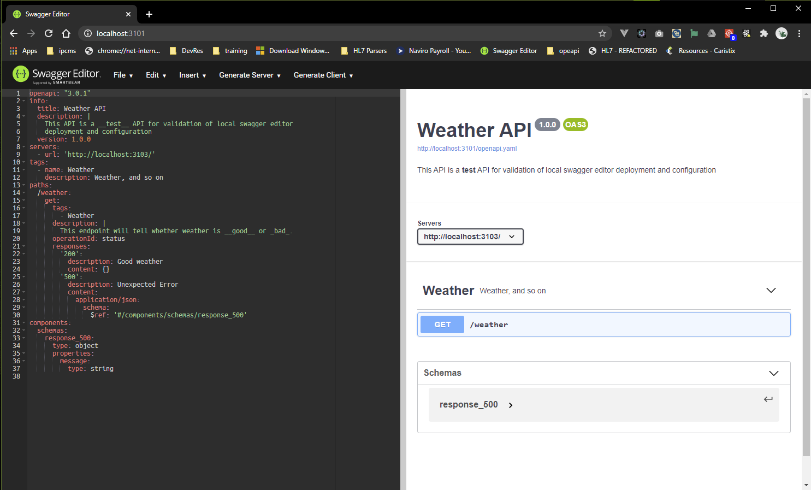
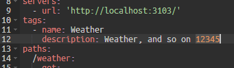
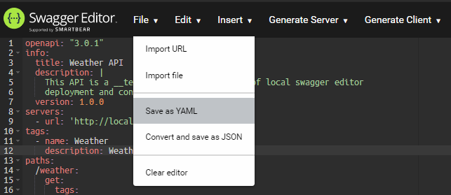
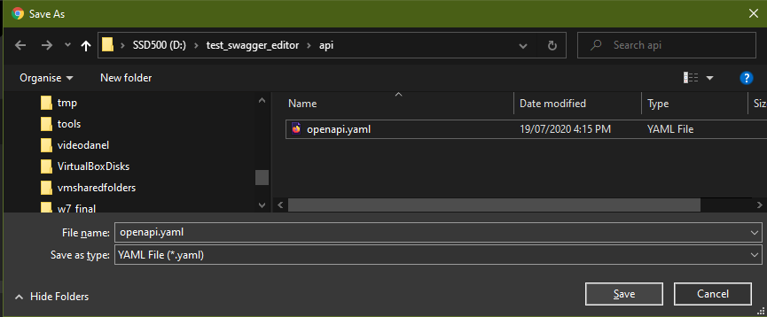
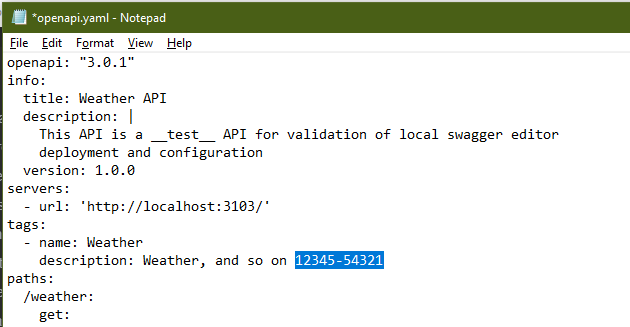
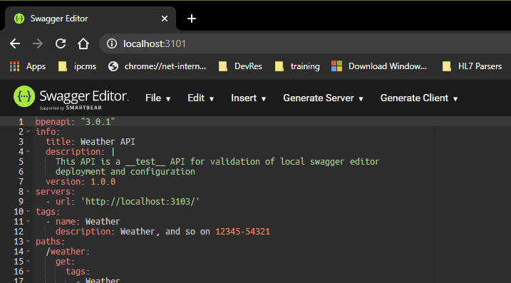
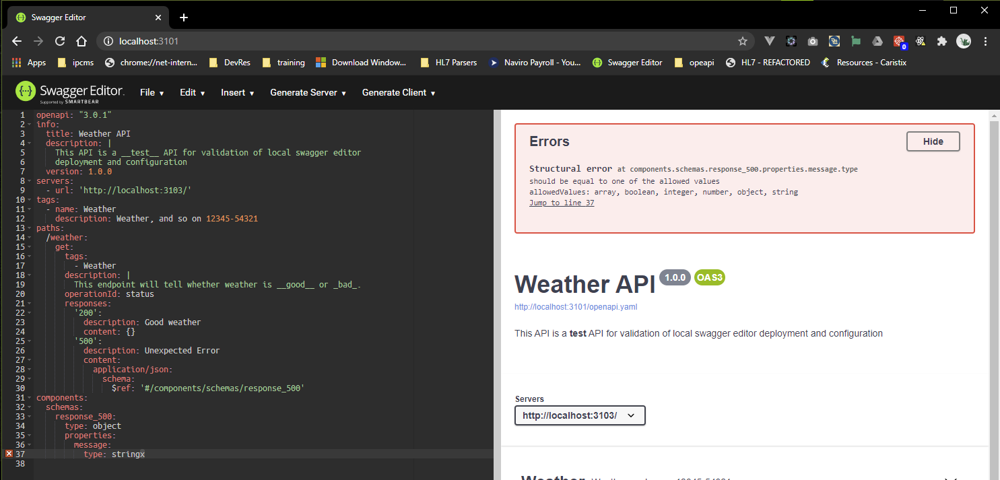

# openapi Spec development using Swagger Editor In Container

## Introduction

It is possible to develop locally-hosted openapi Specifications using the on-line [Swagger Editor](https://editor.swagger.io/). The on-line Swagger Editor allows a specification to be uploaded from the browser's host, edited and saved to the browser's host.

It is also possible, and quite easy, to stand up a locally-hosted Swagger Editor, and eliminate the need to be on-line for this work.

This document describes the resources needed to create a locally-hosted Swagger Editor as a Docker Container, and describes the workflow, with illustrations. The github repository [api_development_with_private_swagger_editor](https://github.com/mwczapski/api_development_with_private_swagger_editor) includes this document and the shell scripts described herein.

## Pre-requisites

The following environment elements are required:

1. Windows 10
2. WSL2 (Windows Subsystem for Linux, v2) - Assumed Debian VM - Others might do as well e.g. Ubuntu, Kali
3. Docker Desktop for Windows installation
4. Google Chrome on Windows

## Assumptions

Scripts provided in this package make certain assumptions about the environment in which they operate.

These are:

1. Pre-requisites are met.
2. The Host provides Docker with the location of the Host directory which it mounts (as a bound volume) in the container to enable sharing of the `openapi.yaml` file between the Host and the Container. This is not strictly necessary just for editing openapi specifications as local files can be edited without the Swagger Editor having to access the api specification from inside its container. The environment is configured this way to enable a Swagger Codegen Container to access the same openapi.yaml to generate stub servers for API testing.
3. Scripts are executed from WSL2 Bash shell.
4. Web Browser which hosts the Swagger Editor UI runs from the Windows Host, i.e. is a browser on Windows.

Once the container is created and starts it can be managed from the Windows command line, however little management will be required.

## What YAML file is being edited?

The name of the API Spec file is pre-configured as `openapi.yaml`. This is what the Swagger Edior Server expects in the shared `api` directory and what it will serve when first shown in the web browser. A Host file with any name can be edited. Pull down the "**File**" menu, click "**Import file**", locate the file and select it. Swagger Editor will happily open the file and let us edit it and save it back to the original location. The container is configured this way to allow transparent generation of stub server code if using the Swagger Editor container in conjunction with the Swagger Codegen container. More on that in another article.

## Notes

Windows 10 `firefox` browser, when requested to save YAML file, saves it to its configured "downloads" directory, unless instructed to do otherwise through settings. To make it more useable for editing YAML files in various Host directories, check that Settings-->Downloads "Always ask you where to save files" is checked. If not, you will need to go to the default downloads directory and copy the edited file to where it is supposed to go.

`Microsoft Edge` for Windows may behave the same way as `firefox`. Change the Settings-->Downloads to set "Always ask you where to save files" if you want to be able to explicitly specify where to save edited files.

## Create Swagger Editor Environment Configuration Script

Create a Docker host directory for the project, let's say `/mnt/d/test_swagger_editor` , and clone to it the github repository [api_development_with_private_swagger_editor](https://github.com/mwczapski/api_development_with_private_swagger_editor) to get the shell scripts and documentation.

The project directory name, in this example `test_swagger_editor`, will be offered as the name of the container to be created. This can be overridden with the environment variable `CONTAINER_NAME`, which must be set before the script is executed.

The script assumes that the Host port `3101` will be mapped to container's port `3001`. This can be overridden with the environment variable `HOST_LISTEN_PORT`, which must be set before the script is executed. If set, all instances of the host port number will be updated in all scripts where it occurs.

If default container name and host listen port are fine then environment variables need not be set.

```shell
mkdir -pv /mnt/d/test_swagger_editor
cd /mnt/d/test_swagger_editor

git clone git@github.com:mwczapski/api_development_with_private_swagger_editor.git . # note trailing . - current working directory

```

Execute the `initialize_editing_environment.sh` script, setting CONTAINER_NAME and HOST_LISTEN_PORT environment variables if and as required. The command below shows how environment variables can be set before script execution. Since the values ar the same as defaults this is purely for illustration and changes nothing.

```
cd /mnt/d/test_swagger_editor
CONTAINER_NAME=test_swagger_editor HOST_LISTEN_PORT=3101 ./scripts/initialize_editing_environment.sh
```

The script will display what it thinks are the correct values, based on the current working directory and the environment variables (if any). It will then request the user to confirm the values and if the response is Y (or any variant startng with lowercase or uppercase Y, like y Yes YES Yeah) it will create the environment configuration variables script used used by other scripts.

Here is the transcript of a session:

```shell
All project artefacts will be created in directory hierarchy starting with 'test_swagger_editor'
Docker Container Name will be 'test_swagger_editor'
Host URL to access the Swagger Editor will be 'http://localhost:3101'

Accept location, container name and port (N/y) [N] ? y

Created environment configuration script: ./scripts/environment_configuration.variables

#!/usr/bin/env bash

SHARED_API_DIR_HOST_WSL="/mnt/d/test_swagger_editor/api"
SHARED_API_DIR_HOST_DOSISH="d:/test_swagger_editor/api"
IMAGE_VERSION="1.0.0"
IMAGE_NAME="mwczapski/swagger_editor"
CONTAINER_NAME="test_swagger_editor"
CONTAINER_HOSTNAME="test_swagger_editor"
CONTAINER_VOLUME_MAPPING="-v d:/test_swagger_editor/api:/api"
CONTAINER_MAPPED_PORTS="-p 127.0.0.1:3101:3001/tcp"
HOST_LISTEN_PORT=3101


Utility scripts:

./scripts/swagger_editor_in_chrome_on_host.sh
./scripts/swagger_editor_in_browser_on_host.sh
./scripts/shell_in_container.sh
./scripts/start_editing_container.sh
./scripts/run_swagger_editor_on_host.sh
./scripts/initialize_editing_environment.sh

To create and start the container execute the following script in WSL2 Terminal window:
 ./scripts/start_editing_container.sh

----------------------------------------------------------------
```

## Start the Swagger Editor Container

Execute the following:

```shell
cd /mnt/d/test_swagger_editor
./scripts/start_editing_container.sh

```

The script will start the container and display potentially useful information, see following transcript. Once the Docker Inage is downloaded by the script the first time it is executed, starting the container takes less than a second on my machine.

```shell
83130a4f6a77979036706c8c5419eb0923276cf7ac62379019700bad81bf6884

----------------------------------------------------------
Container 'test_swagger_editor' created

Host URL to run the Swagger Editor is 'http://localhost:3101'

To run the Swagger Editor in a Host's Chrome Web Browser, execute from the WSL Terminal window:
 ./scripts/swagger_editor_in_chrome_on_host.sh

To run the Swagger Editor in a Host's default Web Browser, execute from the WSL Terminal window:
 ./scripts/swagger_editor_in_browser_on_host.sh

To access container's shell, execute from the WSL Terminal window:
 ./scripts/shell_in_container.sh

To stop and remove the container, execute from the WSL Terminal window:
 ./scripts/stop_and_delete_editing_container.sh
----------------------------------------------------------
```

## Run Swagger Editor - An example session

Make sure the container is started.

Use one of the provided shell scripts from the WSL2 terminal window:

```shell
./scripts/swagger_editor_in_chrome_on_host.sh
```

or

```shell
./scripts/swagger_editor_in_browser_on_host.sh
```

or start your favourite web browser on the Host and enter the URL: `http://localhost:3101`

The browser will show rhe page with two panes - editor pane on the left and explore/test pane on the right.



Make some trivial change in one of the description sections, for example:



Pull down the "**File**" menu and choose "**Save as YAML**"



Navigate to the correct Host directory, choose the name of the file to overwrite and "**Save**"



Open the `openapi.yaml` file just saved using an external editor on Windows, for example `Notepad`.

```shell
notepad.exe d:\test_swagger_editor\api\openapi.yaml
```

Make a trivial change and save the file.



Refresh the Swagger Editor browser window and ee the change.



Make a mistake and see what Swagger Editor has to say:



Correct the error, save, close the browser.

Inspect the file in the file system.

```shell
cat ./api/openapi.yaml
openapi: "3.0.1"
info:
  title: Weather API
  description: |
    This API is a __test__ API for validation of local swagger editor
    deployment and configuration
  version: 1.0.0
servers:
  - url: 'http://localhost:3103/'
tags:
  - name: Weather
    description: Weather, and so on 12345-54321
paths:
  /weather:
    get:
      tags:
        - Weather
      description: |
        This endpoint will tell whether weather is __good__ or _bad_.
      operationId: status
      responses:
        '200':
          description: Good weather
          content: {}
        '500':
          description: Unexpected Error
          content:
            application/json:
              schema:
                $ref: '#/components/schemas/response_500'
components:
  schemas:
    response_500:
      type: object
      properties:
        message:
          type: string
```

That's it.

## Stop and Delete the Swagger Editor Container

The environment is configured in such a way that the `openapi.yaml` file is persisted to the Host storage so that if the contianer is deleted, which it is by default when it is stopped, `openapi.yaml` and all other files in the `api` directory shared between the Host and the Container will be preserved and will be accessible when the container is started next time.

```shell
cd /mnt/d/test_swagger_editor
./scripts/stop_and_delete_editing_container.sh
```

## Resources

### Github

[Swagger_Editor_3_Docker_Container](https://github.com/mwczapski/Swagger_Editor_3_Docker_Container)

[Swagger_Codegen_3_Docker_Container](https://github.com/mwczapski/Swagger_Codegen_3_Docker_Container)

[Swagger_Development_Workflow](https://github.com/mwczapski/Swagger_Development_Workflow)

[api_development_with_private_swagger_editor](https://github.com/mwczapski/api_development_with_private_swagger_editor)

### Docker Hub

[Swagger Editor Image Docker Image on Docker Hub](https://hub.docker.com/r/mwczapski/swagger_editor)

[Swagger Codegen Image on Docker Hub](https://hub.docker.com/r/mwczapski/swagger_codegen)

## License

The MIT License (MIT)

Copyright © 2020 Michael Czapski

Rights to Docker (and related), Git (and related), Debian, its packages and libraries, and 3rd party packages and libraries, belong to their respective owners.
